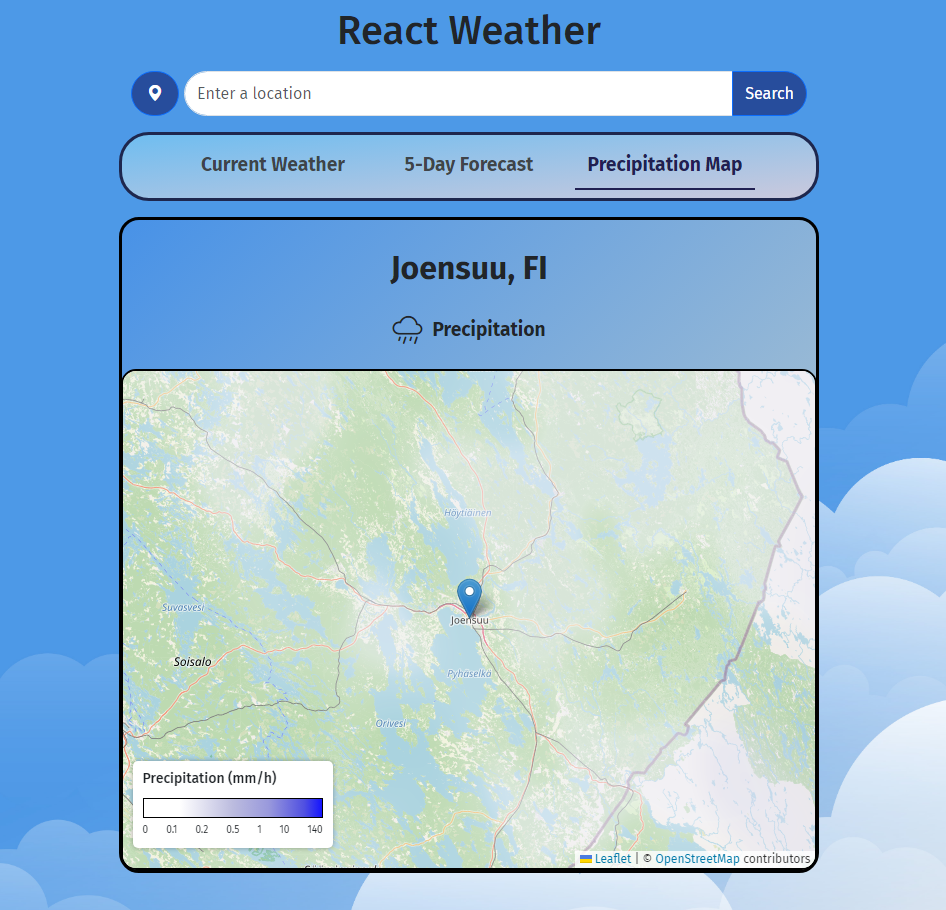

# React Weather App
Final project for Web Programming I course (fall 2024). Allows users to search weather information from chosen location.

## Features
- Users can 
    - view current weather<br>
    <br>
    - view 5-day forecast<br>
    <br>
    - view a precipitation map<br>
    <br>

## Techonologies and tools used
- React.js
- React Router
- VSCode
- HTML
- CSS
- JavaScript
- Openweathermap API
- Axios
- React Leaflet
- React Bootstrap
- Fontawesome

## Installation and Usage
To start using this app. Follow these steps:
1. Clone the repository
2. Add your Openweather API key to ```example.apikey.js``` and rename it to ```apikey.js```
3. Run ```npm install``` to install all neccessary modules
4. Run ```npm start dev``` to start development server
5. Navigate to ```http://localhost:5173/``` on your browser

Using the app:
- The app will display the current weather in Joensuu by default
- You can use the search bar to find weather from desired location by entering the name of the location and pressing enter or clicking the ```Search``` button
- You can also press the location button on the left side of the search bar to get weather of your location (on the first time you'll need to give permission to use your location)
- You can choose to view ```Current Weather```, ```5-Day Forecast``` or ```Precipitation Map``` of the location by pressing the corresponding menu item
